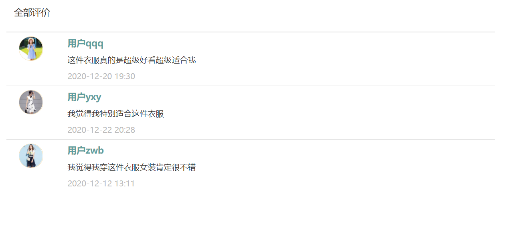

## 源程序简要说明

### 前端部分

前端内容主要分为三部分：css样式、html代码、javascript代码。

部分css样式和javascript代码作为静态文件放在static文件夹中。

html代码作为模板全部存放再templates文件夹中。

#### 用户端

index.html:

商城的主界面，列出了商品分类，展示了最近畅销的一些商品，还有轮播框表示这是商品的广告。


login.html:

用户的登录页面，用户需要输入用户名和密码。


sign_up.html：

用户的注册界面，需要输入用户名、密码和邮箱。


product.html：

商品详细界面，展示了商品的详细信息，包括商品价格、商品描述和商品库存等，还展示了所有的评价。


cart.html:

用户的购物车页面，用户把商品加入购物车后可以在这里看到


checkout.html：

结算页面，用户结算购物车，用户可以选择地址，确认商品信息。


favorite.html：

收藏夹界面，展示了用户收藏的商品，可以删除。


user_info.html:

用户的个人信息界面，展示了用户头像和用户信息，可以修改头像和编辑信息。


user_address.html:

用户的收货地址界面，可以新增和编辑收货地址。


shop_info.html：

用户端看见的商店界面，展示了商店的信息和商店的全部商品信息。


order_list.html:

用户的订单页面，展示了用户的所有订单，包括”待发货“、”待收货“、”待评价“、”已评价“4种状态，用户可以确认收货，也可以对订单进行评价。


product_list.html:

商品搜索界面，展示了所有搜索到的商品，可以根据条件进行排序和翻页。


user_coupons.html:

用户的优惠券界面，展示了用户的所有优惠券。


foot_print.html:

用户的浏览记录，展示了用户所有的浏览记录。


message_list.html：

消息界面，展示了商家对用户发的消息。


#### 商家端

index.html:

商家的主要页面，展示了商家信息，商家可以进行编辑。


login.html:

商家的登录页面。


sign_up.html：

商家的注册界面，需要输入用户名、密码和邮箱。


shop_register.html

商家注册店铺额界面，需要输入店铺详细信息。


product_list.html

管理商品的界面。


product_types.html

管理商品类别的界面。


product.html

商家看到的商品详细信息界面。


order_list.html

订单管理界面，


messages.html

商家看到的消息界面


extra_info.html

商家的销售情况页面，可以看到店铺的销量、店铺的销售额和店铺的关注情况。


## 前端重要方法实现

### 和后端交互数据

前后端之间通过Ajax传递数据，数据的格式是Json。

AJAX即“Asynchronous JavaScript and XML”（异步的avaScript技术），指的是一套综合了多项技术的浏览器端网页开发技术。

JSON（JavaScript Object Notation，JavaScript对象表示法，读作/ˈdʒeɪsən/）是一种由道格拉斯·克罗克福特构想和设计、轻量级的资料交换语言。


```javascript
    var goodList = [
        {
            id: "1111",
            goodName: "商品名",
            goodLink: "product.html",
            imgURL: "../images/index/4.jpg",
            goodDescrip: "商品描述商品描述商品描述商品描述商品描述商品描述",
            unitPrice: 1
        },
        {
            id: "1111",
            goodName: "商品名",
            goodLink: "product.html",
            imgURL: "../images/index/4.jpg",
            goodDescrip: "商品描述商品描述商品描述商品描述商品描述商品描述",
            unitPrice: 8
        },
        {
            id: "1111",
            goodName: "商品名",
            goodLink: "product.html",
            imgURL: "../images/index/4.jpg",
            goodDescrip: "商品描述商品描述商品描述商品描述商品描述商品描述",
            unitPrice: 4
        }];
```

代码 使用Json来传递商品数据信息


当需要从后端获取数据时，可以使用Ajax中的GET方法。
```javascript
 $.ajax({
            type: "GET",
            url: "/index/",
            dataType: "json",
            success: function (result) {

            },
            error: function (result) {
            },
        })
```

代码 GET类型的ajax举例


当需要给后端发送数据时，可以使用Ajax中的POST方法。

```javascript
 $.ajax({
            type: "POST",
            url: "/login/",
            data: {
                username: $("#username").val(),
                password: $("#password").val(),
            },
            dataType: "json",
            success: function (result) {
                console.log(result);
                if (result.data.status == "success") {
                    window.open("/index/", "_self");
                } else {
                    prompt.setAttribute("class", "alert alert-danger");
                    prompt.innerHTML = (result.data.data);
                }
            },
            error: function (result) {
                
            },
        })
```

代码 登录界面的post类型的ajax

### 动态生成元素

前端使用了HTML中的DOM方法和Jquery来动态生成网页元素。

在从后端获取到了数据之后，就可以把数据显示在网页上了。

利用DOM中的方法可以创建元素并给元素添加属性，使用Jquery中的方法可以将元素添加到指定位置上。

```javascript
let frameDiv = document.createElement("div");
frameDiv.setAttribute("class", "col-md-3 good-frame");
rowGoodDiv.append(frameDiv);
```

### 实现分页和排序功能

实现分页和排序功能是一个难点，我们通过Javascript函数实现。

在搜索商品的界面，我们实现了分页和排序功能，可以根据价格和销量对搜索到的商品进行排序。

前端首先获取后端的数据，保存在本地变量中。

当切换排序方式时，会根据不同的排序函数对数据进行排序。

```javascript
    //价格升序比较函数
    var asc = function (x, y) {
        return x.fields.price - y.fields.price;
    }
    //价格降序比较函数
    var desc = function (x, y) {
        return y.fields.price - x.fields.price;
    }
    //销量降序比较函数
    var saleDesc = function (x, y) {
        return y.fields.sales - x.fields.sales;
    }
```

代码 不同条件下的排序函数


排完序之后，需要将排好序的数据分组，一页需要展示多少商品，一组就有几个商品数据。

当切换页面时，获取当前的页面数，然后展示相应页面的商品。

```javascript
    //上一页
	function prevPage() {
        if (nowPage > 1) {
            nowPage--;
            let nowActiveLi = $(".pagination").children(".active");
            nowActiveLi.removeClass("active");
            nowActiveLi.prev().addClass("active");
            loadGoods(splitGoodList[nowPage - 1]);//展示nowPage页面的商品
        }
    }

	//下一页
    function nextPage();
        
	//跳转到某一页
    function thisPage(a);
```


### 使用组件

我们使用了Bootstrap，其中包含了较多组件，可以提供给用户非常好的交互体验。

导航栏：

```html
<nav class="navbar navbar-default" role="navigation">
	<div class="container-fluid">
	<div class="navbar-header">
		<a class="navbar-brand" href="#">教程</a>
	</div>
	<div>
		<ul class="nav navbar-nav">
			<li class="active"><a href="#">iOS</a></li>
			<li class="dropdown">
				<a href="#" class="dropdown-toggle" data-toggle="dropdown">
					Java
					<b class="caret"></b>
				</a>
				<ul class="dropdown-menu">
					<li><a href="#">jmeter</a></li>
					<li><a href="#">EJB</a></li>
					<li><a href="#">Jasper Report</a></li>
					<li class="divider"></li>
					<li><a href="#">分离的链接</a></li>
				</ul>
			</li>
		</ul>
	</div>
	</div>
</nav>


```

代码 导航栏的代码举例


图 导航栏


除此之外，我们还实现了模态框和图片轮播功能。

模态框可以提供用户编辑数据或者提醒，独立于页面而存在，可以提供信息和交互。


图 模态框


图片轮播可以作为广告为，让我们的页面看起来非常的精美。


图 图片轮播

## 系统实现效果

### 用户端

#### 登录


#### 注册


#### 商城主界面


#### 产品主界面


#### 商家主界面


#### 查看评论



#### 购物车


可以对购物车里面的数量进行加减操作和删除操作，下方会实时显示当前合计。

#### 收藏夹


#### 浏览记录


#### 消息


在商家发货时或者发布优惠券时等情况，商家会给用户发送一条消息来提醒用户

#### 订单页面


订单页面分为4个部分，是根据订单的状态来划分的。

用户可以确认收货。


用户可以对已经收货的商品进行评价。


#### 个人主页

用户可以进行修改头像，编辑资料和修改密码的操作。


#### 地址页面


通过点击按钮，用户可以新增或编辑地址。

#### 结算界面

用户可以选择收货地址，被选中的地址会改变样式。

在选择收货地址的同时，用户需要确认商品信息。


### 商家端

#### 登录和注册

和用户界面大致相同

#### 完善信息

商家第一次登陆需要完善自己的店铺信息。


#### 管理商品

商家可以进行编辑、查看详情、上架或下架、发布优惠券和删除删除这些操作。


#### 管理商品类别


#### 管理订单

商家可以发货，还可以提醒已收货但未评价的用户评价订单。


#### 管理优惠券


#### 管理消息

买家在下单收货的时候会发送一条消息提示商家。


#### 销售情况

销售情况分为了三个模块：

销量展示、销售额汇总和店铺信息变化。


#### 商品销量展示

在销量展示页面，商家可以看到本店的商品销量情况。

销售情况以饼状图的样式展现。


#### 店铺销售额汇总

在店铺销售额汇总页面，商家可以看到所有注册商家的销售额情况。

销售额情况以柱状图的样式展现。


#### 店铺信息变化

在店铺信息变化页面，商家可以看到本店的销售额变化情况和关注本店的人数变化情况。

店铺信息变化情况以折线图的形式展现。


## 个人体会

18373441

覃启浩

在这次数据库设计中，我负责的是前端的部分。

学习过程。为了完成这次实验，我需要学习很多新的东西，首先是html和css，我自学阅读玩了Head First HTML这本书，这大概花了断断续续一个月。为了实现页面逻辑，我需要学习JavaScript和Jquery，为了和后端交互，我还需要学习AJAX方法。为了让页面好看一点，我去学习框架和组件，在舍友的帮助下我了解到了Twitter开发的Bootstrap，这真的对我帮助很大。我学习了很多很多的新知识，这确实是一个快乐的过程。

分工明确很重要。由于对于前端和后端的不了解，我们开始都是各做各的，各学各的，也不去问对方做了什么工作，这样导致的一个后果是：对接的时候非常难受。前端不了解后端数据库，面对不断增加的需求显得不耐烦；后端把前端的工作一起做了，导致后端的工作量加大了。可以说，我们多花费了很多时间，而且各自都做得比较难受。这让我明白了一个道理，合作的时候一定要分工明确，一定要知道对方的工作，不能只顾自己的。

总结。说实话这个实验真的话费了我很多精力，我花了几乎数不清楚的时间来完成这实验，看着自己的系统变得日渐精美，还是有一点欣慰的。这应该是一次美好的体验。